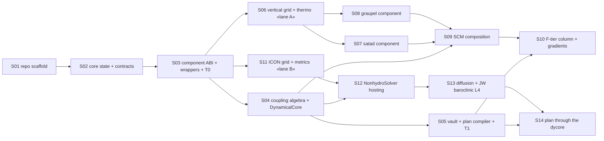

# symcon Implementation Plan — Overview

**Implements:** *symcon architecture* v1.3 + *symcon repo layout* (companion documents; §-references point into the architecture doc).
**Horizon:** vertical slice fully specified — SCM physics column (satad + graupel, SUS coupling, F-tier gradients) and idealized dycore (NonhydroSolver + diffusion + Jablonowski–Williamson, T1 plan) — with post-slice phases outlined in `outlines/`.
**Execution model:** sequential trunk (S01–S05) with two parallel lanes (A: column, B: dycore) that fork after S03. Human review gate on every trunk merge; lane steps land by PR.

---

## 1. Agent contract (applies to every step)

1. **Read** `SPEC.md` (the frozen contract: what to build, interfaces later steps import, acceptance criteria) and `PLAN.md` (how: ordered tasks, reference-mining instructions, pitfalls). SPEC wins over PLAN on conflict; the architecture doc wins over both — flag contradictions in the step's `STATUS.md` instead of silently resolving.
2. **Mine references before writing code.** Steps name reference repos and *candidate* module paths. Candidate paths are hints, not facts — icon4py/gt4py reorganize frequently. Discover the real path (`grep -r`, package metadata), then record every consulted source in the repo-root `REFERENCES.lock` as `name, url, commit SHA, paths used, what was taken`. Scientific constants and algorithm structure are **taken from references, never improvised** — that is how this plan minimizes scientific divergence.
3. **Pin, don't float.** gt4py + icon4py versions are chosen once (S01) from icon4py's own tested combination and written to `constraints/`; later steps do not bump them without a trunk decision.
4. **Definition of done, per step:** all acceptance tests in SPEC pass locally (`pytest -m "not gpu"` at minimum; `gpu`/`mpi` markers where the step says so) · `ruff check` + `ruff format --check` clean · `mypy` clean on `symcon-core` (strict) · `lint-imports` (import-linter) clean · new public API has docstrings + appears in `docs/api` stubs · `STATUS.md` written in the step folder (what was built, deviations, follow-ups) · one PR per step.
5. **Never commit data.** Reference datasets arrive through icon4py's own datatest fixtures or `pooch` manifests with checksums.
6. **Tolerances are contracts.** Where SPEC states a tolerance, loosening it requires a `STATUS.md` justification and human sign-off — tolerance creep is how scientific divergence sneaks in.
7. **Environment:** agents may assume CPU pytest, MPI up to np=4 (`pytest-mpi`), one CUDA GPU, and network access for reference fetching. GPU-marked tests must degrade to skip (not fail) when no device is present.

## 2. Step index and dependency DAG

Parallelism: after S03 merges, lanes A and B proceed concurrently with the remaining trunk (S04, S05). Within lane A, S07 ∥ S08. Cross-lane interfaces are frozen by SPECs, so concurrent agents never negotiate APIs ad hoc.

| lane | steps | first possible start |
|---|---|---|
| trunk | S01 → S02 → S03 → S04 → S05 | — |
| A (column) | S06 → {S07 ∥ S08} → S09 → S10 | after S03 (S09 waits for S04; S10 for S05) |
| B (dycore) | S11 → S12 → S13 → S14 | after S03 (S12 waits for S04; S14 for S05) |

## 3. Reference corpus (pin in S01, reuse everywhere)

| id | source | role |
|---|---|---|
| `icon4py` | github.com/C2SM/icon4py | primary implementation donor: dycore/diffusion/microphysics granules, grid/metrics/interpolation factories, serialbox datatest fixtures, JW driver experiment |
| `gt4py` | github.com/GridTools/gt4py | DSL substrate; version = whatever pinned icon4py requires |
| `icon-fortran` | ICON open-source release (icon-model.org → gitlab.dwd.de/icon/icon-model, BSD-3) | scientific ground truth for algorithm reading: `mo_satad`, graupel (`gscp_*`), `mo_solve_nonhydro`, `mo_nh_stepping`, `mo_nh_testcases*`, `mo_vertical_grid` |
| `sympl` | github.com/mcgibbon/sympl + fork github.com/stubbiali/sympl (branch `oop`) | component/property semantics; the `out=`/Checker/Operator/Factory mechanisms (§4.2) |
| `tasmania` | github.com/stubbiali/tasmania | federation classes, `DynamicalCore`, `SequentialTendencyStepper` reference implementations |
| `icon-tutorial-2025` | DWD/MPI-M tutorial PDF (local) | process ordering, fast/slow semantics, JW/idealized configuration (ch. 3–4) |
| optional: `muphys` C++ graupel rewrite; `ghex`; `mpi4jax` | discover at need | cross-checks / later phases |

## 4. Global conventions the steps assume

Repo layout exactly as the layout document (uv workspace; `symcon-core` / `symcon-icon` / `symcon-bridges`; import-linter `core ↛ icon`). Test markers: `gpu`, `mpi`, `slow`, `data` (fetches remote reference data). Backend parametrization: component tests run `embedded` + `gtfn_cpu` always, `gtfn_gpu` under the `gpu` marker. All floating-point comparisons through one `symcon.core.testing.assert_allclose` wrapper that reports worst-offender location and relative/absolute error — tolerance forensics matter at L2.

## 5. Post-slice phases (outlined only — see `outlines/`)

P2 distributed execution · P3 full NWP physics + bridges · P4 ingestion & real data (L5) · P5 tiers T2/T3 · P6 differentiable distributed + DA/hybrid demos · P7 presets, docs, anemoi.
